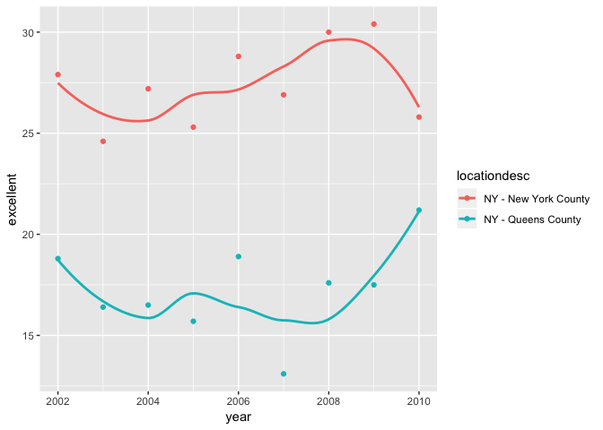

p8105\_hw2\_zf2211
================
Francis
9/30/2018

``` r
library(tidyverse)
```

    ## ── Attaching packages ──────────────────────────────────────────────────────────────────────── tidyverse 1.2.1 ──

    ## ✔ ggplot2 3.0.0     ✔ purrr   0.2.5
    ## ✔ tibble  1.4.2     ✔ dplyr   0.7.6
    ## ✔ tidyr   0.8.1     ✔ stringr 1.3.1
    ## ✔ readr   1.1.1     ✔ forcats 0.3.0

    ## ── Conflicts ─────────────────────────────────────────────────────────────────────────── tidyverse_conflicts() ──
    ## ✖ dplyr::filter() masks stats::filter()
    ## ✖ dplyr::lag()    masks stats::lag()

``` r
library(tidyr)
```

Problem1
--------

``` r
Transit_Data = 
  read_csv("./data/NYC_Transit_Subway_Entrance_And_Exit_Data.csv") %>% 
  janitor::clean_names() %>% 
  select(line, station_name, station_latitude, station_longitude, route1:route11, entry, vending, entrance_type, ada)
```

    ## Parsed with column specification:
    ## cols(
    ##   .default = col_character(),
    ##   `Station Latitude` = col_double(),
    ##   `Station Longitude` = col_double(),
    ##   Route8 = col_integer(),
    ##   Route9 = col_integer(),
    ##   Route10 = col_integer(),
    ##   Route11 = col_integer(),
    ##   ADA = col_logical(),
    ##   `Free Crossover` = col_logical(),
    ##   `Entrance Latitude` = col_double(),
    ##   `Entrance Longitude` = col_double()
    ## )

    ## See spec(...) for full column specifications.

``` r
select(Transit_Data, entry) %>% 
mutate(entry = recode(entry, "YES" = TRUE, "NO" = FALSE))
```

    ## # A tibble: 1,868 x 1
    ##    entry
    ##    <lgl>
    ##  1 TRUE 
    ##  2 TRUE 
    ##  3 TRUE 
    ##  4 TRUE 
    ##  5 TRUE 
    ##  6 TRUE 
    ##  7 TRUE 
    ##  8 TRUE 
    ##  9 TRUE 
    ## 10 TRUE 
    ## # ... with 1,858 more rows

This dataset contains variables like:

``` r
names(Transit_Data)
```

    ##  [1] "line"              "station_name"      "station_latitude" 
    ##  [4] "station_longitude" "route1"            "route2"           
    ##  [7] "route3"            "route4"            "route5"           
    ## [10] "route6"            "route7"            "route8"           
    ## [13] "route9"            "route10"           "route11"          
    ## [16] "entry"             "vending"           "entrance_type"    
    ## [19] "ada"

I used **janitor::clean\_names** to clean the names of data, then **select** several variables from the data, at last converted the entry into logical variables.

The number of rows and columns of the resulting dataset is

``` r
nrow(Transit_Data)
```

    ## [1] 1868

``` r
ncol(Transit_Data)
```

    ## [1] 19

No, it is not yet tidy because route1 to route11 is separated. It will be better to sort out together.

1)There are

``` r
count(distinct(Transit_Data, station_name, line))
```

    ## # A tibble: 1 x 1
    ##       n
    ##   <int>
    ## 1   465

stations.

2)There are

``` r
count(distinct(filter(Transit_Data, ada == TRUE), station_name, line))
```

    ## # A tibble: 1 x 1
    ##       n
    ##   <int>
    ## 1    84

stations are ADA compliant.

3)The proportion of station entrance/exits without vending allow entrance is

``` r
n_without_vending_allow_entrance = 
  Transit_Data %>% 
  filter(vending == "NO", entry == "YES") %>% 
  count()
n_without_vending = 
  Transit_Data %>% 
  filter(vending == "NO") %>% 
  count()
n_without_vending_allow_entrance / 
  n_without_vending
```

    ##           n
    ## 1 0.3770492

4)There are

``` r
reformed_data = Transit_Data %>% 
  gather(key = route_number, value = route_served, route1:route11) %>% 
  filter(route_served != 'NA')
reformed_data %>% 
  filter(route_served == "A") %>% 
  distinct(line, station_name) %>% 
  nrow()
```

    ## [1] 60

distict stations serve A train.

5)Of the stations that serve the A train, there are

``` r
reformed_data %>% 
  filter(route_served == "A", ada ==TRUE) %>% 
  distinct(line, station_name) %>% 
  nrow()
```

    ## [1] 17

distinct stations are ADA compliant.

Problem2
--------

``` r
library(readxl)
library(tidyverse)
```

``` r
MrTrash_Wheel = 
  read_excel("./data/HealthyHarborWaterWheelTotals2018-7-28.xlsx", sheet = 1, range = "A2:N338") %>% 
  janitor::clean_names() %>% 
  filter(dumpster != "NA") %>% 
  mutate(sports_balls = as.integer(sports_balls)) 
```

``` r
prcp2016 = 
  read_excel("./data/HealthyHarborWaterWheelTotals2018-7-28.xlsx", sheet = 5, range = "A2:B14") %>% 
  janitor::clean_names() %>%
  filter(!is.na("Total")) %>% 
  mutate(year = 2016)
```

``` r
prcp2017 = 
  read_excel("./data/HealthyHarborWaterWheelTotals2018-7-28.xlsx", sheet = 4, range = "A2:B14") %>% 
  janitor::clean_names() %>%
  filter(!is.na("Total")) %>% 
  mutate(year = 2017)
```

Combine datasets

``` r
prcp = 
  bind_rows(prcp2016, prcp2017) %>%
   mutate(month = month.name[month]) %>% 
    select(year, month, total)
```

The MrTrash\_Wheel dataset contains 285 observations and 14 variables, and the prcp dataset contains 24 observations and 3 variables. We focus on the weight, volumn and different items; total precipitation of each month. The total precipitation in 2017 was 32.93, and the median number of sports balls in a dumpster in 2016 was 26.

``` r
devtools::install_github("p8105/p8105.datasets")
```

    ## Skipping install of 'p8105.datasets' from a github remote, the SHA1 (21f5ad1c) has not changed since last install.
    ##   Use `force = TRUE` to force installation

``` r
library(p8105.datasets)
data(brfss_smart2010, package = "p8105.datasets")
```

``` r
brfss = 
  brfss_smart2010 %>% 
  janitor::clean_names() %>% 
  filter (topic == "Overall Health") %>% 
  select (-class, -topic, - question, -sample_size, -(confidence_limit_low:geo_location)) %>% 
  spread (key = response, value = data_value ) %>% 
  janitor::clean_names() %>% 
  mutate(Proportion = excellent + very_good)
```

Answers: There are

``` r
nrow(distinct(brfss, locationdesc))
```

    ## [1] 404

unique locations are included in the dataset.

``` r
nrow(distinct(brfss, locationabbr))
```

    ## [1] 51

states in US are represented.

``` r
count_(brfss, 'locationabbr', sort = TRUE)
```

    ## # A tibble: 51 x 2
    ##    locationabbr     n
    ##    <chr>        <int>
    ##  1 NJ             146
    ##  2 FL             122
    ##  3 NC             115
    ##  4 WA              97
    ##  5 MD              90
    ##  6 MA              79
    ##  7 TX              71
    ##  8 NY              65
    ##  9 SC              63
    ## 10 CO              59
    ## # ... with 41 more rows

NJ is the most observed.

``` r
brfss_2002 = filter(brfss, year == 2002)
median(brfss_2002$excellent, na.rm = TRUE)
```

    ## [1] 23.6

is the median of the "Excellent" response value.

``` r
ggplot(brfss_2002, aes(x = excellent)) + geom_histogram()
```

    ## `stat_bin()` using `bins = 30`. Pick better value with `binwidth`.

    ## Warning: Removed 2 rows containing non-finite values (stat_bin).


``` r
brfss_NY = filter(brfss, locationdesc == "NY - New York County")
brfss_Qu = filter(brfss, locationdesc == "NY - Queens County")
brfss_NYQu = rbind(brfss_NY, brfss_Qu)
ggplot(brfss_NYQu, aes(x = year, y = excellent, color = locationdesc)) + geom_point() + geom_smooth(se = FALSE)
```

    ## `geom_smooth()` using method = 'loess' and formula 'y ~ x'


